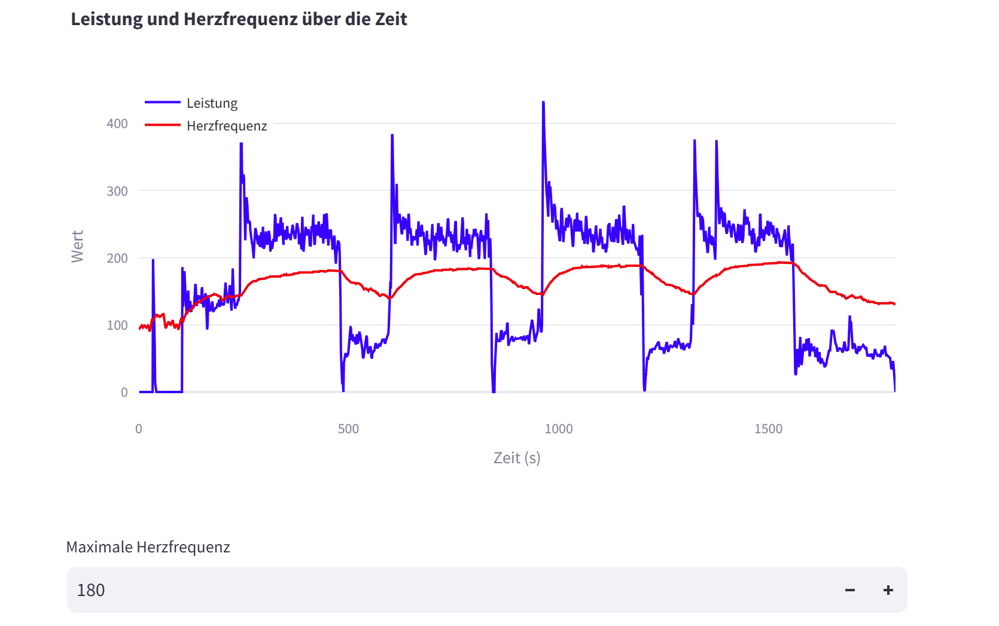
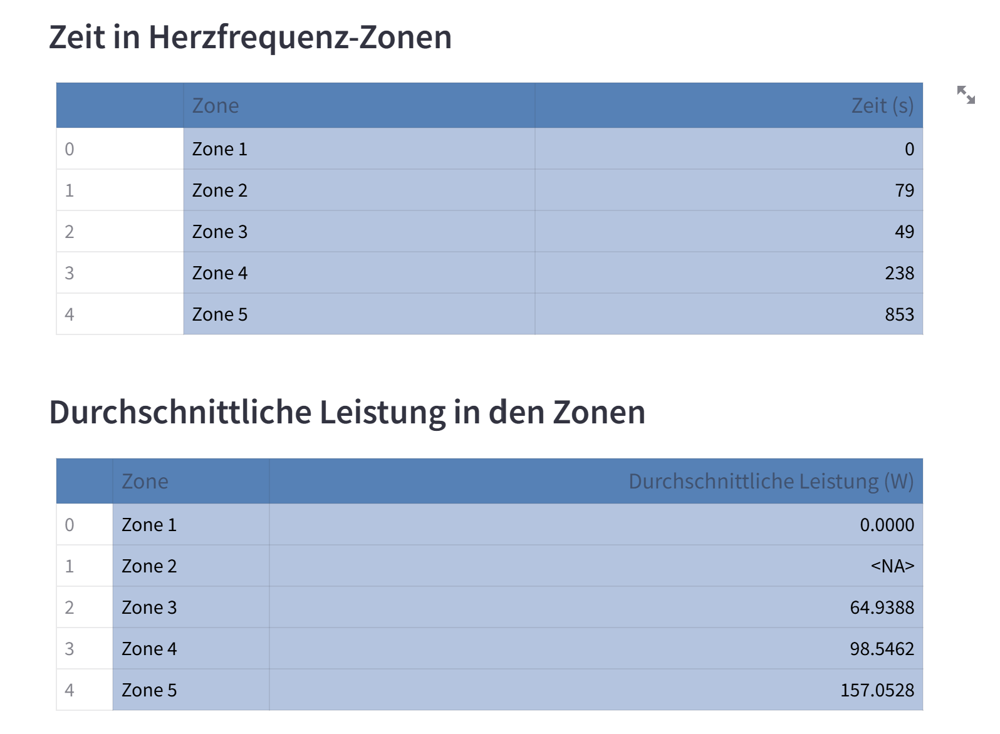

# Aufgabenstellungen zur Programmierübung 2

## Requirements
- streamlit
- plotly
- pandas
### auch möglich: 
- `pip install -r requirements.txt`

### starten der App
## Repository klonen:
- Öffne die Befehlspalette mit Strg+Shift+P (Windows) oder Cmd+Shift+P (Mac).
- Gib `Git: Clone` ein und füge die Repository-URL ein.
- Wähle den Zielordner auf deinem Computer aus, in den du das Repository klonen möchtest.
## Führe deine Streamlit-App aus:
- Öffne das Terminal in VS Code.
- Navigiere zum Verzeichnis, in dem sich deine Python-Datei befindet.
- Führe den folgenden Befehl aus, um deine Streamlit-App zu starten: `streamlit run main.py`
- Deine Streamlit-App wird im integrierten VS Code-Panel angezeigt.
## App benutzen: 
- Die App zeigt nun die EKG-Daten und Leistungsdaten an.
- Durch die Eingabe der maximalen Herzfrequenz erfolgt eine visuelle Anpassung der Zonen, und es werden die Zeit sowie die durchschnittliche Leistung pro Zone berechnet.
 

## Virtuelle Umgebung erstellen:
- Verwende den Befehl `python -m venv <Umgebungsname>`, um eine neue virtuelle Umgebung zu erstellen.
## Aktiviere die virtuelle Umgebung:
- Nutze den Befehl source `<Umgebungsname>/bin/activate` (Linux/Mac) oder .`\<Umgebungsname>\Scripts\activate`(Windows), um die virtuelle Umgebung zu aktivieren.
## Deaktiviere die virtuelle Umgebung:
- Führe den Befehl `deactivate` aus, um die virtuelle Umgebung zu deaktivieren.

